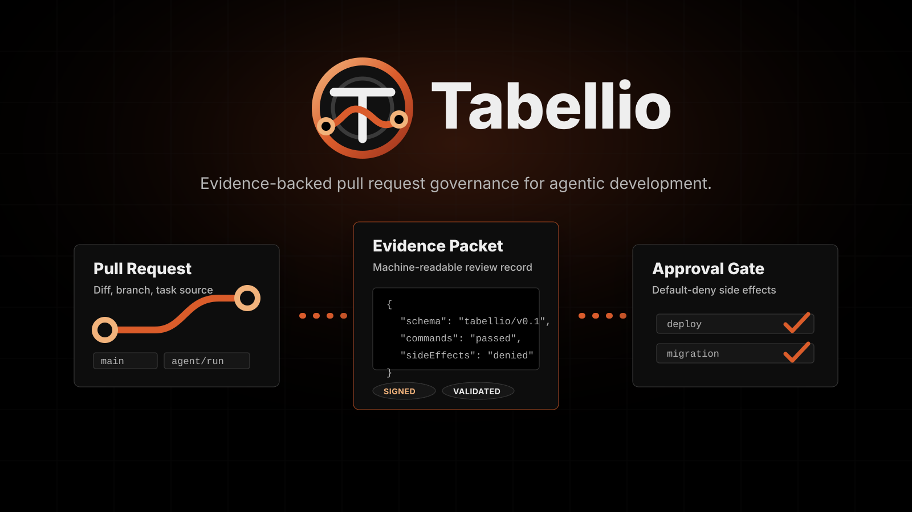

# Tabellio



[](https://nodejs.org/)
[](https://github.com/)
[](https://json-schema.org/)
[](https://docs.oasis-open.org/sarif/sarif/v2.1.0/sarif-v2.1.0.html)
[](https://abhinav.github.io/git-spice/)
[](https://entire.io/)
[](LICENSE)

GitHub-native context and evidence for agentic development.

Tabellio gives coding agents a deterministic Git foundation: standard Git repositories, isolated worktrees, immutable commit IDs, merge previews, compare-and-swap ref updates, and context packets tied to the exact diff. GitHub stores code and provides a thin pull-request shell. Tabellio keeps agent transcripts, review state, validation results, and control refs outside that public code-storage boundary.

## What It Adds

Tabellio attaches a structured evidence packet to a pull request. The packet is small enough to inspect in review and strict enough to validate in CI.

| Area | Evidence |
| --- | --- |
| Task | Source request, issue, ticket, or manual prompt summary |
| Git | Repository, base branch, head branch, commit SHA, and PR metadata |
| Runtime | Human, CI, or agent runtime that produced the change |
| Diff | Changed files |
| Validation | Exact-head commands plus structural, semantic, workflow, visual, operational, and security results |
| Approvals | Required, granted, denied, or skipped approvals |
| Side effects | Deployment, migration, infra, billing, secret, provider, and destructive-action policy |
| Artifacts | Evidence files generated by the run |

## Native Git Foundation

### Local provenance rebuild

The incremental TAB-18–29 rebuild adds a local PostgreSQL evidence projection.
Its current foundation stores source-attributed observations, typed relationships,
and exact base/head/merge-base identities. Imports are atomic and idempotent;
replay preserves the same digest. Missing, stale, conflicting, inferred, or failed
evidence prevents a passed review result. Review packets omit source payloads and
facts belonging to another candidate.

Run the sample on macOS or Linux with Node.js, Git, and PostgreSQL client/server binaries on `PATH`:

```bash
npm run tabellio:provenance:demo
```

The demo creates a temporary Git repository and private local PostgreSQL cluster,
imports a synthetic provider journey, restarts the database server, deletes and
replays the derived record, builds a review packet, and proves that a moved base
blocks the old evidence. It stops its server and removes its temporary files.
Git and PostgreSQL operations are real; Plane, Entire, GitHub, Buildkite, and
security observations in this sample are explicitly synthetic. This is not a
live-provider or security-scanner certification.

The demo receipt includes a failure matrix with expected and actual verdicts,
safe reasons, and lineage digests where available. It exercises missing, stale,
conflicting, tampered, secret, failed-validation, outage, and moved-base cases.
Source replay runs twice in a newly created local database, verifies the original
digest, and checks that source snapshots and Git refs remain unchanged. Cleanup
and local cost/time are recorded even when the demo fails.

To replace the sample security observation with real bounded checks, install
Gitleaks 8.30.1 and ast-grep 0.45.1 on `PATH`, then run:

```bash
node scripts/demo-provenance.mjs --verify-security-scanners true
```

On Apple Silicon macOS or x86-64 Linux, `. .buildkite/scripts/security-tools.sh`
installs the pinned tools into a temporary directory and exposes them on `PATH`.
Set `TABELLIO_SECURITY_TOOLS_DIR` to reuse a tool directory. The installer verifies
the Gitleaks archive checksum and does not run npm package install scripts.
Configured CI uses this setup before checks; the required security
validator fails when scanners are missing instead of skipping scanner fixtures.
Run the same required check locally with `npm run tabellio:provenance:security:check`.

The scanner reads immutable Git blobs without running candidate code. It uses
Gitleaks defaults and explicit JavaScript/TypeScript rules for unverified JWT
decoding, unsigned JWT configuration, disabled TLS verification, and dynamic
`eval`. Candidate ignore files and suppression comments cannot grant a pass.
Insecure HTTP dependency references fail; other declared npm dependencies remain
blocked pending vulnerability evidence. These checks cover the listed rules;
they do not establish the absence of all authorization or dependency defects.

`tabellio-provenance security --input <lineage.json> --repo <repo> --now <time>`
produces a separate security receipt. `import-security` accepts that receipt with
the scoped lineage query, current repository candidate, and expected
`--policy-digest`. It binds the receipt to the same safe packet and candidate,
rejects modified receipts, and preserves failed or unavailable checks as blocking
evidence. Findings contain rule IDs, severity, file locations, and content
digests; matched secrets and source snippets are omitted. The findings contract
is `schemas/provenance-security-review.schema.json`.

For development validation, include PostgreSQL integration tests in that same
isolated cluster:

```bash
node scripts/demo-provenance.mjs --verify-storage-tests true --out /tmp/tabellio-demo.json
```

`review` returns the full current candidate, distinct review and security verdicts,
actions for failed or blocked evidence, and matching GitHub status payloads. Known
Git and provider records receive source links; other records retain their exact
source identifiers and lineage digest. Load verified security finding locations
with `--security-input <receipt.json> --policy-digest <expected-digest>`.
`--report-url` supplies a credential-free report link for both status contexts.

`review-intent` prepares an immutable publication intent from the same scoped
lineage query. `publish-review` accepts `--intent-input` and `--approval-input`,
uses `GH_TOKEN`, rechecks the current candidate and GitHub origin,
and publishes separate `Tabellio / provenance review` and
`Tabellio / provenance security` contexts. The approval uses
`tabellio-provenance-status-approval/v0.1` with `id`, `intentDigest`, `approved: true`,
`approvedBy`, `approvedAt`, `expiresAt`, and `reason`; its lifetime is at most one
hour. Publication receipts report delivery separately from review verdicts.
Each intent explicitly targets the configured `control` remote. Each approval is
reserved there in `refs/tabellio/provenance-status-reservations/<approval digest>` before
GitHub delivery. Production publication uses authenticated `gh` to verify a
separate private control repository and consistent fetch/push targets before
each control write. Remote compare-and-swap allows one publisher across clones;
repeated requests reuse the receipt, and uncertain attempts require inspection
before a new approval. The local demo exercises this flow through a fake GitHub
transport and compares the delivered states with the CLI result.

The `tabellio-provenance` CLI supports `capture`, `import`, `import-sources`, `replay`, `replay-sources`,
`show`, `review`, `review-intent`, `publish-review`, and `packet`. `import-sources` normalizes a bundle of Plane,
Entire, GitHub, and Buildkite snapshots and captures Git directly from `--repo`.
Readers preserve healthy sources while reporting authentication, permission,
missing-record, outage, and malformed-input failures as blocked. The demo imports
all five sources, then verifies missing independent security evidence blocks review.
External snapshots remain explicitly synthetic in the sample.
The packet contract is `schemas/provenance-review-packet.schema.json`. Packets
contain only candidate-scoped facts and fixed failure explanations; their complete
JSON envelope, including its digest, is limited to 65,536 UTF-8 bytes.
`replay-sources` rebuilds from the original source bundle using `--repo`, `--input`,
the original capture time in `--now`, and `--expected-digest` from the import receipt.
It writes only when the rebuilt digest matches; changed or missing sources return
blocked evidence without storing a replacement. Reordering snapshots and repeating
the replay preserve the same record. Source snapshots are never modified.
Database operations require an explicit local
`--database-url`; review and packet commands also require `--repo` so readiness
is checked against current Git state. `--now` supplies a deterministic evaluation
time for fixtures; normal operation uses current time. The lower-level
`tabellio-local-store` CLI defaults to the dedicated local `tabellio` database,
never an inherited application's `DATABASE_URL`.

The capture and retention boundary lives in `tabellio.data-boundary.json`.
Raw prompts, transcripts, provider bodies, and credentials are excluded. The
remaining release work includes failure/recovery acceptance and the explicit
release decision. No cloud provisioning,
automatic publication, deployment, or learning is introduced.

The native engine runs through the installed `git` executable. It never constructs shell commands.

| Component | Role |
| --- | --- |
| `GitProcess` | Executes argument arrays with prompts disabled and typed failures |
| `RepositoryStore` | Repository contract for Tabellio's GitHub-backed workflow |
| `NativeGitStore` | Reads commits and diffs, manages worktrees, previews merges, and updates refs safely |
| `WorkspaceManager` | Gives each agent run a contained worktree path |
| Context packet | Binds task, actor, exact commits, changed files, checkpoints, and merge status |
| Agent-run CLI | Orchestrates start, checkpoint, validation, status, and safe promotion |

## Review Questions

AI-assisted pull requests should not depend on reviewer trust alone. Tabellio gives reviewers a repeatable answer to:

- What changed?
- Why did it change?
- What commands ran?
- What failed or was skipped?
- Did the workflow try to deploy, migrate, read secrets, touch billing, or mutate infrastructure?
- Where is the machine-readable audit packet?

## Workflow Stack

| Layer | Tooling | Role |
| --- | --- | --- |
| Runtime | [Node.js 20+](https://nodejs.org/) | Runs the local writer and validators |
| Validation | `tabellio-validate` on any trusted worker | Runs exact committed command or typed product validators and stores results on a Git ref |
| Evidence contract | [JSON Schema](https://json-schema.org/) | Validates the evidence envelope and external-action policy |
| Code storage | [GitHub](https://github.com/) | Stores code refs and tags; provides a thin pull-request shell |
| Stacked review | [git-spice](https://abhinav.github.io/git-spice/) | Stack engine for small dependent GitHub pull requests |
| Checkpoint ledger | [Entire](https://entire.io/) and [Entire CLI](https://github.com/entireio/cli) | Required default for agent session and checkpoint context |
| Git substrate | Standard Git CLI, bare repositories, and worktrees | Stores repositories, branches, commits, patches, and agent-created code state |
| Agent review | [OpenAI Codex](https://openai.com/codex/) | Produces findings imported into the durable GitHub review ledger |
| Prior art | [SLSA](https://slsa.dev/) and [in-toto](https://in-toto.io/) | Inspiration for provenance and supply-chain evidence, without a compliance claim |

`origin` is the canonical GitHub code remote. Entire is the required checkpoint ledger; git-spice manages stacks; Tabellio owns validation and durable review state. Private control refs are external state and are rejected when their destination is `origin`.

## Core Files

| Path | Purpose |
| --- | --- |
| `tabellio.platform.json` | Code-storage boundary, stack, ledger, validation, review, and control-ref contract |
| `schemas/` | Evidence and external-action JSON schemas |
| `scripts/providers/native-git-store.mjs` | Standard Git storage provider |
| `scripts/providers/git-spice-stack-manager.mjs` | Read-only git-spice stack adapter |
| `scripts/providers/git-spice-operations.mjs` | Approval-gated git-spice submit, update, sync, restack, and merge adapter |
| `scripts/providers/entire-ledger-provider.mjs` | Metadata-only Entire checkpoint adapter |
| `scripts/providers/github-provider.mjs` | Read-only GitHub pull-request, review, comment, status, and check adapter |
| `scripts/lib/git-json-ledger.mjs` | Versioned, compare-and-swap JSON state on standard Git refs |
| `scripts/lib/review-cycle.mjs` | Durable GitHub and agent review/fix state machine |
| `scripts/lib/validation-runner.mjs` | Exact-commit, shell-free validation with bounded evidence logs |
| `scripts/tabellio-merge-ready.mjs` | Approval-gated publication of one exact-validation commit status |
| `scripts/lib/control-ref-transport.mjs` | Approval-gated, fast-forward-only sharing of review, validation, and Entire refs |
| `scripts/tabellio-preflight.mjs` | Fail-closed GitHub, Entire, hook-trust, and release-main readiness checks |
| `scripts/tabellio-release.mjs` | Integrity-bound post-merge control-ref, tag, and GitHub release orchestration |
| `scripts/lib/` | Git process, repository contract, worktree, and context primitives |
| `scripts/` | Dependency-free capture, writer, and validators |
| `examples/` | Minimal valid context, evidence, review, validation, stack, and ledger fixtures |
| `templates/` | Pull request checklist for evidence-backed review |
| `docs/` | Setup, schema, workflow model, Codex review, tooling stack, and research grounding |

## Quick Start

Enable the required ledger, initialize stacks, and validate the canonical platform contract:

```bash
entire enable --agent codex --project
git-spice repo init
npm run tabellio:platform:check
node scripts/tabellio-validate.mjs run --repo . --commit HEAD --manifest tabellio.validation.json
```

Configure Entire's supported `strategy_options.checkpoint_remote` in `.entire/settings.json` to target the private GitHub control repository, and keep `strategy_options.push_sessions` false. Tabellio preflight fails closed when the effective checkpoint remote differs from the platform control remote or automatic checkpoint pushing could bypass release approval.

Use `gate` in CI. It persists the same exact-head result but exits non-zero unless the final decision is `passed`:

```bash
tabellio-validate gate --repo . --repo-id github.com/owner/repository --base main --commit HEAD --manifest tabellio.validation.json
```

Plan an integrity-bound `Tabellio / exact-head-validation` status from that exact validation:

```bash
tabellio-merge-ready plan \
  --repo . \
  --commit HEAD \
  --out /secure/operator/status-intent.json
```

Publishing requires a separate short-lived approval and scoped GitHub credential. The status proves only that the committed validation manifest passed for that head; review clearance, other checks, policy, and merge authority remain separate. See [Exact-head validation status](docs/merge-ready-status.md).

Validation worktrees and isolated home directories use private system-temporary sessions. `--workspace-root /absolute/external/path` may select another external parent; repository-internal and `.git/**` paths are rejected.

Keep `origin` limited to ordinary code branches and tags. Configure a separate private GitHub repository under another remote name before publishing control refs. The transport refuses to target `origin`.

Before agent or release work, run:

```bash
node scripts/tabellio-preflight.mjs --profile agent
node scripts/tabellio-preflight.mjs --profile release
```

Hook trust failures identify the exact Codex `/hooks` action required. Release profile additionally requires clean `main` equal to `origin/main`.

Before merging a release-capable pull request, synchronize the durable review cycle and require exact-head readiness:

```bash
tabellio-review gate \
  --repo . \
  --repo-id github.com/owner/repository \
  --owner owner \
  --remote-repo repository \
  --number 42 \
  --token-file /secure/path/github-token \
  --actor pre-merge-gate
```

The gate exits non-zero for untriaged feedback, unpublished fixes, failed or pending checks, missing exact-head validation, or a pull request that is already merged or closed. Merge approval remains a separate human action.

Validate the bundled fixture:

```bash
node scripts/check-tabellio-evidence-envelope.mjs --evidence examples/tabellio-evidence/minimal-evidence.json
node scripts/check-tabellio-external-actions.mjs --evidence examples/tabellio-evidence/minimal-evidence.json
```

Generate evidence from the current Git state:

```bash
node scripts/write-tabellio-evidence-envelope.mjs --out tabellio-pr-evidence.json
node scripts/check-tabellio-evidence-envelope.mjs --evidence tabellio-pr-evidence.json
node scripts/check-tabellio-external-actions.mjs --evidence tabellio-pr-evidence.json
```

Capture GitHub-bound context first, then bind evidence to it:

```bash
node scripts/capture-tabellio-context.mjs \
  --repo . \
  --repo-id IntelIP/Tabellio \
  --base main \
  --head HEAD \
  --out tabellio-context.json
node scripts/check-tabellio-context.mjs --context tabellio-context.json
node scripts/write-tabellio-evidence-envelope.mjs \
  --context tabellio-context.json \
  --out tabellio-pr-evidence.json
```

Context capture requires an Entire checkpoint by default. For legacy Git-note repositories during migration, pass `--ledger git-note` explicitly.

Run the local agent lifecycle:

```bash
node scripts/tabellio-run.mjs start \
  --run-id run-42 \
  --repo . \
  --base main \
  --task-summary "Add deterministic import validation"

# Edit and commit inside the returned workspace path, then:
node scripts/tabellio-run.mjs checkpoint --run-id run-42 --repo . --summary "Implementation committed"
node scripts/tabellio-run.mjs finish --run-id run-42 --repo . -- npm test
node scripts/tabellio-run.mjs promote --run-id run-42 --repo .
```

See [Agent run lifecycle](docs/agent-run-lifecycle.md) for state and failure behavior.
See [Product validation](docs/product-validation.md) for acceptance contracts, typed evidence, cost gates, and repository adapters.

Package scripts:

```bash
npm run check
npm run tabellio:run -- status --run-id run-42
npm run tabellio:run:example:check
npm run tabellio:stack -- --repo . --repo-id IntelIP/Tabellio --out tabellio-stack.json
npm run tabellio:stack:check
npm run tabellio:stack:operation:example:check
npm run tabellio:review:example:check
npm run tabellio:validate:example:check
npm run tabellio:ledger -- --repo . --repo-id IntelIP/Tabellio --base main --head HEAD --out tabellio-ledger.json
npm run tabellio:ledger:check
npm run tabellio:context:capture
npm run tabellio:context:check
npm run tabellio:evidence:write
npm run tabellio:evidence:check
npm run tabellio:external-actions:check
```

## Protected Action Classes

These actions require explicit approval before attempted execution:

- deployment
- database migration
- infrastructure change
- DNS or hosting change
- billing or live-money action
- credentialed provider read
- secret-value read
- destructive workspace action

The external-action checker fails when an action is marked `attempted: true` without `approved: true`.

## Docs

- [Getting started](docs/getting-started.md)
- [Agentic tooling stack](docs/tooling-stack.md)
- [GitHub code-storage boundary](docs/github-code-storage-boundary.md)
- [Agent run lifecycle](docs/agent-run-lifecycle.md)
- [Approved stack operations](docs/stack-operations.md)
- [Durable review and fix loop](docs/review-loop.md)
- [Exact-commit validation](docs/validation-runner.md)
- [Exact-head validation status](docs/merge-ready-status.md)
- [Operations hardening](docs/operations-hardening.md)
- [Workflow model](docs/workflow-model.md)
- [Native Git foundation](docs/native-git-foundation.md)
- [Evidence schema](docs/evidence-schema.md)
- [Codex review](docs/codex-review.md)
- [Research grounding](docs/research-grounding.md)
- [Brand system](docs/brand.md)
- [Security policy](SECURITY.md)
- [Contributing](CONTRIBUTING.md)
- [Changelog](CHANGELOG.md)

## License

Apache-2.0. See [LICENSE](LICENSE) and [NOTICE](NOTICE).
