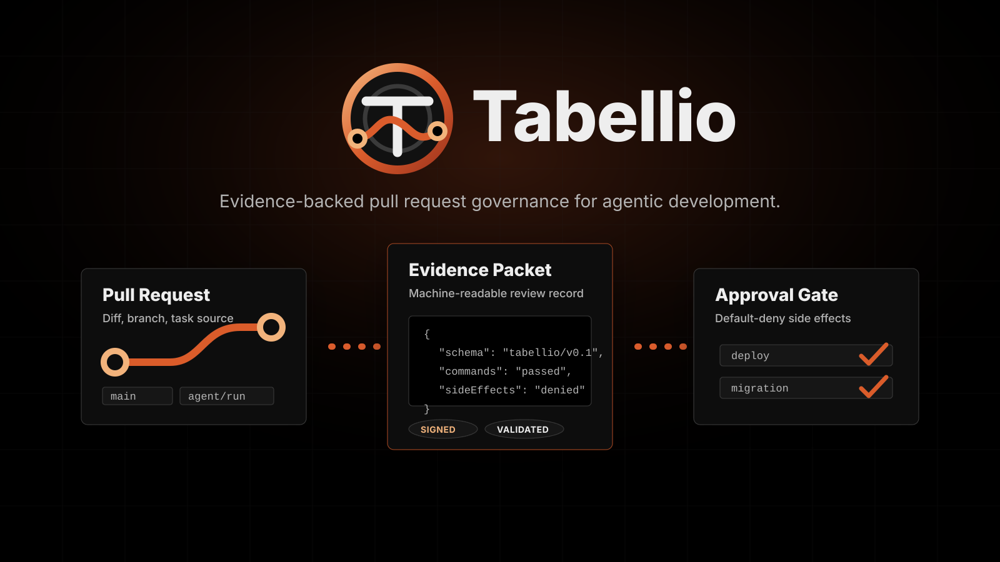
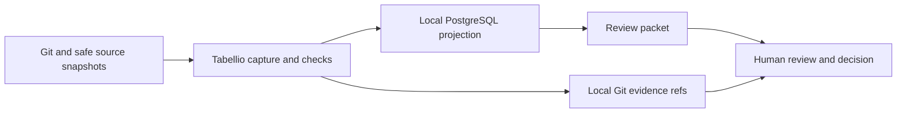

# Tabellio

Tabellio helps teams review AI-assisted code by collecting what changed, what was checked, and which actions were approved for the exact code version.



**Published: [@intelip/tabellio 0.7.0](https://www.npmjs.com/package/@intelip/tabellio/v/0.7.0).**
This is an early project for evaluation on trusted workers.
Its local demo is repeatable; production adoption and performance are not established by that demo.

[Documentation](docs/README.md) · [Examples](examples/) · [Releases](https://github.com/IntelIP/Tabellio/releases) · [Help](https://github.com/IntelIP/Tabellio/issues)

## Try the published package

Start in a new directory. The demo needs:

- macOS or Linux, running as a regular user.
- Node.js 20 or later and npm. Repository CI uses Node.js 22.23.1.
- Git 2.38 or later.
- PostgreSQL client and server binaries on `PATH`: `psql`, `createdb`, `initdb`, and `pg_ctl`.
  PostgreSQL 14.15 was used for the documented macOS run.

The demo creates its own temporary Git repository and private PostgreSQL cluster.
You do not need an existing database, provider account, token, Entire installation,
or git-spice installation for this sample. Internet access is needed to install the package.

```bash
npm install --save-dev @intelip/tabellio@0.7.0
npx tabellio-version --expect-version 0.7.0
npx tabellio-provenance-demo
```

The version command checks the installed runner. The demo imports observations,
restarts the database, rebuilds its derived records, and checks review decisions.
It then stops its PostgreSQL server and removes its temporary files.
See [Try Tabellio](docs/try-tabellio.md) for setup, troubleshooting, and a saved receipt.

## What you should see

Both commands print JSON. Successful receipts include `ok: true` for the version
check and `status: "passed"` for the demo. Expected failure cases remain blocked.

Actual terminal-output excerpt from a clean installed-package run on macOS:

```json
{
  "status": "passed",
  "checks": {
    "sourceReplay": "passed",
    "changedSourceReplay": "blocked",
    "missingSecurity": "blocked",
    "postgresServerRestart": "passed",
    "deleteAndReplay": "passed",
    "movedBase": "blocked"
  },
  "cost": { "usd": 0, "modelCalls": 0, "cloudCalls": 0 },
  "cleanup": "passed"
}
```

This is an excerpt, not the full receipt; commit IDs and timing vary per run.
Git and PostgreSQL operations are real. Plane, Entire, GitHub, Buildkite, and
security observations are **synthetic fixtures**. GitHub status delivery uses a
local fake transport. Nothing in this sample is published to a provider.
The sample proves the local workflow, not live provider access or scanner effectiveness.

## What Tabellio can do

| Capability | Practical result |
| --- | --- |
| Capture exact Git context | A packet names the base, head, changed files, and checkpoint evidence. |
| Run committed validation commands | Results apply to one code version; later edits can invalidate readiness. |
| Keep durable review and run state | Work can resume with its checks, findings, and next action preserved. |
| Import safe source observations | Local PostgreSQL records keep source identity and replayable relationships. |
| Build candidate-scoped review packets | Missing, stale, conflicting, or failed evidence remains visible and blocking. |
| Record independent security evidence | Bounded scanner receipts remain separate from an agent's review claim. |
| Prepare approved status publication | Review results can be shared through an explicit, short-lived approval. |
| Join delivery evidence | Reports distinguish code, releases, deployments, and missing relationships. |

The package also includes optional git-spice stack operations and a **legacy Plane
import capability**. IntelIP uses AgentShift for current project tracking;
Tabellio does not include an AgentShift adapter.

## Connect a real repository

Repository integration has extra requirements: a trusted Git checkout, genuine
Entire 0.7.7 or later checkpoints, and the committed platform and validation contracts.
Use git-spice 0.18 or later when working with stacked branches. PostgreSQL is
needed for the local provenance store; it is not needed for every Git-ref workflow.

Start with [Connect a repository](docs/getting-started.md).
That guide separates installed CLI commands from source-checkout development.
Exported provider snapshots need explicit access and safe input handling.
Publishing statuses or sharing private control refs needs separate approval.

## How the pieces fit


```mermaid
flowchart LR
    A[Git and safe source snapshots] --> B[Tabellio capture and checks]
    B --> C[Local PostgreSQL projection]
    C --> D[Review packet]
    B --> E[Local Git evidence refs]
    D --> F[Human review and decision]
    E --> F
```

GitHub stores code and pull requests. Private checkpoint, validation, and review
state stays on customer-owned local storage by default. PostgreSQL stores a
derived evidence view; source observations and Git remain the recovery inputs.
See [Native Git foundation](docs/native-git-foundation.md) and
[Provenance operations](docs/provenance.md) for the detailed boundaries.

## Material limits

- Passing checks do not grant merge, release, deployment, or credential authority.
- Missing access is a blocker, not a successful or empty observation.
- Security checks cover their declared rules, not every possible vulnerability.
- Hosted exact-head validation needs genuine, privately provisioned checkpoint evidence.
- No autonomous production service, cloud provisioning, or automatic learning is included.

## Contribute, operate, and get help

[Contributing](CONTRIBUTING.md) explains source setup, checks, and handoffs.
[Agent instructions](AGENTS.md) route coding agents to the same standards.
[Operate and release](docs/operate-and-release.md) covers protected operator procedures.

Ask questions or report ordinary bugs through [GitHub Issues](https://github.com/IntelIP/Tabellio/issues).
Use [private vulnerability reporting](https://github.com/IntelIP/Tabellio/security/advisories/new)
for security reports; read the [security policy](SECURITY.md) first.

Tabellio is licensed under **Apache-2.0**. See [LICENSE](LICENSE) and [NOTICE](NOTICE).
